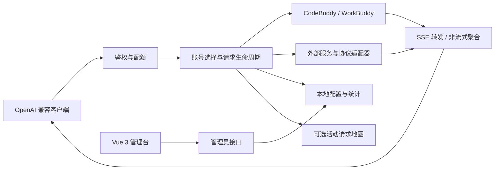
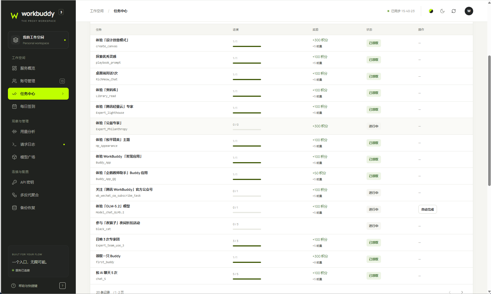

# WorkBuddy2API 图文介绍

[返回项目首页](../README.md) · [部署与维护](../README-deploy.md)

## 一个接口，一处管理

请求从兼容客户端进入 Node.js 服务，经过鉴权、配额和账号选择后交给上游；Vue 3 管理台负责配置与观察运行情况。



原生与各外部适配器的能力不完全相同。请通过模型广场和客户端实际验证需要的功能，不依据截图中的模型名称判断可用性。

## 服务概览

概览集中展示账号、用量、积分、流量趋势、最近请求和运行状态。首屏与数据分开加载，地图按需加载，关闭地图时不加载其前端组件。


## 配色与夜间模式

日间可在右上角切换八组配色：青柠与炭黑、熔岩与深海、帝王紫与柠檬、甜酷粉与黑曜石、霓虹蓝与电光紫、冰薄荷与樱桃红、晶石紫与电光荧、霓虹赤与电光蓝。夜间采用黑色底色。


## 模型与用量

模型广场展示当前服务能提供的模型，并提供筛选与接入信息。模型来源、倍率、活动标签等由上游与账号状态决定，不在文档中承诺固定价格或免费时段。


上图为项目维护者提供的实际模型广场截图，展示当时返回的混元、GLM、MiniMax、Kimi、DeepSeek 等系列分类。模型数量、具体版本、倍率与活动标签随上游和账号状态变化，请以自己管理台的实时目录为准。

用量分析支持日期、模型及账号维度，区分输入、输出和缓存，并可查看请求数量和积分统计。不同模型使用高反差曲线，便于比较。


## 全自动任务中心

**本项目的重点特色：把成长任务的接受、执行、进度回查和领奖连成自动流程，并支持跨账号批量运行。** 管理台保留单项入口，也提供服务器后台执行队列。



上图由项目维护者提供，展示成长任务列表：每行列出任务名称、任务代码、完成进度、积分 / 能量奖励和当前状态。支持自动执行且尚未完成的任务会提供“自动完成”入口，例如截图中的模型体验任务。

### 如何使用

1. 进入“任务中心”，在“账号成长任务”中选择当前服务账号或指定账号，点击“扫描任务”。扫描按需触发，用于获取最新进度。
2. 只处理某个任务时，点击该行的“自动完成”。后端会检查是否已领取、是否已经达标，再执行对应动作、回查进度并尝试领奖。
3. 批量处理时，使用页面下方“跨账号执行队列”的“全账号执行任务”。服务器依次接受和执行已适配任务，保留步骤结果。
4. 处理日常活动时，选择“全账号一键日常”，运行签到及已适配的日常流程。执行后检查队列内各步骤反馈。

离开页面不影响服务器继续执行；重新进入可查看进度。队列运行时禁止重复启动另一批队列。队列保存在内存中，服务重启后不会自动恢复未完成步骤。

### 自动执行范围

自动能力由当前版本已适配的任务动作决定，不是看到任务名称就能任意执行。已领取任务会跳过；未适配、未解锁或需要人工操作的任务仍需按上游要求处理。进度更新可能延迟，具体奖励与达标结果以上游返回为准，队列执行完成也不代表每一步都已成功领奖。

部分任务会发起真实聊天或活动操作，可能消耗额度。任务中心将执行反馈与领奖结果展示出来，便于确认实际完成情况；截图中的奖励不是固定收益承诺。

## 活动请求地图

地图仅展示处理中的请求，结束后移除轨迹。绿色流星循环表示“请求仍在进行”，并不表示真实网络传输进度。支持轨迹悬浮、详情固定、拖动、缩放、自动聚焦和全屏。


定位使用本地 DB-IP City Lite，底图使用 Natural Earth 矢量数据。中国省份及其他国家一级行政区仅在地理库有相应数据时展示；未知地址不伪造位置。内网、代理、NAT 都会影响定位解释。详情包含脱敏密钥信息，不显示完整 Key。

地图全局开关会同步关闭服务器追踪和定位 worker，适合不需要地图或希望减少资源占用的部署。[配置与数据来源](../backend/REQUEST-MAP.md)

## 管理流程

| 页面 | 常见操作 |
| --- | --- |
| 账号管理 | 连接自己的账号、切换服务账号、查看余额和有效期、配置轮换 |
| 任务中心 | 扫描成长任务、单项自动完成、全账号执行任务、全账号一键日常及队列反馈 |
| 每日签到 | 查看签到状态、手动执行签到 |
| 请求日志 | 查看成功 / 失败、耗时、模型和用量 |
| API 密钥 | 为不同客户端创建有权限边界的附加 Key |
| 多反代聚合 | 添加外部服务商、配置协议和模型映射、测试连通性 |
| 备份恢复 | 下载完整备份、校验导入、配置服务器自动备份 |

## 截图来源与复现

本页的服务概览、配色、用量与地图五张截图于 2026-09-28 由仓库构建产物和隔离 fixture 生成，使用合成账号与用量，源站地址替换为文档示例地址。其中的请求模型、日期与地理坐标均为演示，不是生产运行记录。

模型广场图片 `models.png` 和任务中心图片 `tasks-center.png` 为项目维护者提供的实际界面截图，不由以下脚本生成或覆盖。它们反映截图时的模型目录与任务状态，不保证其他账号拥有相同模型、任务或奖励。

在仓库根目录运行：

```bash
npm --prefix frontend ci
npm --prefix frontend run build
# 若尚未安装 Playwright 的 Chromium：
cd frontend
npx playwright install chromium
cd ..
node frontend/scripts/capture-docs.mjs
```

脚本仅启动本机演示服务，不连接真实模型、不执行真实签到；将图片保存到 `docs/images/`。截图中的流星为某个动画帧，实际页面支持持续动画。
