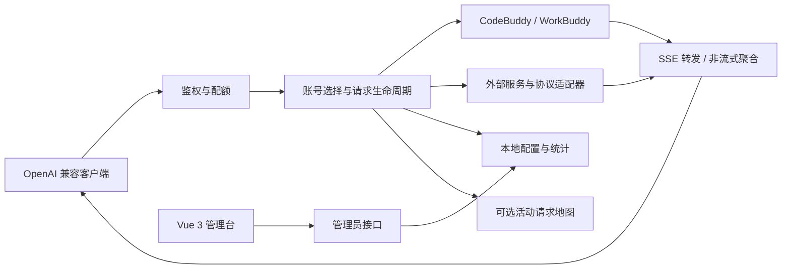
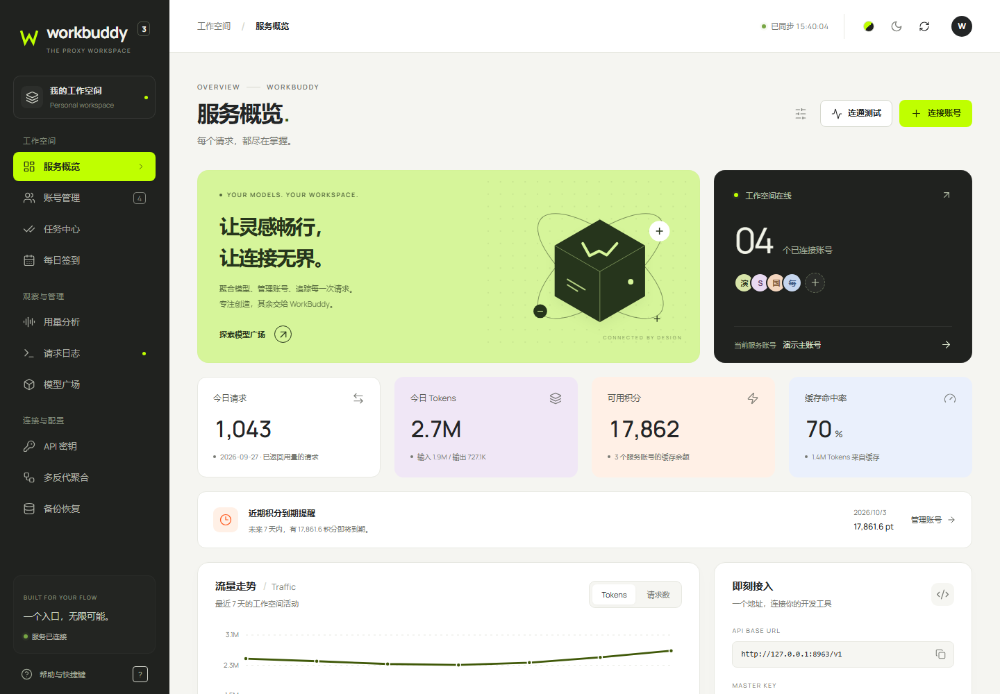
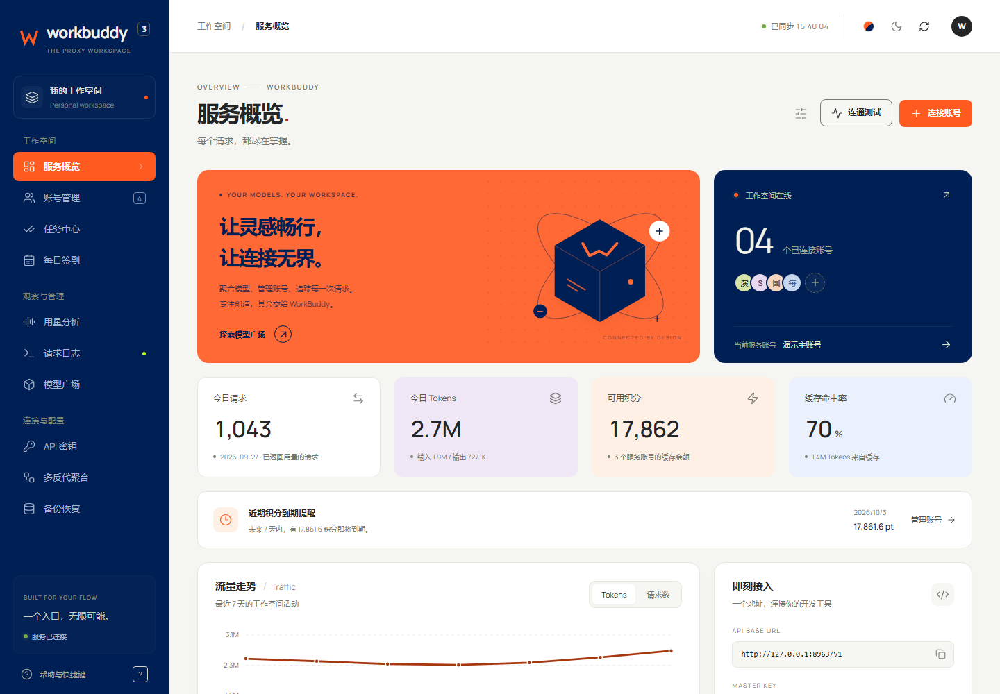
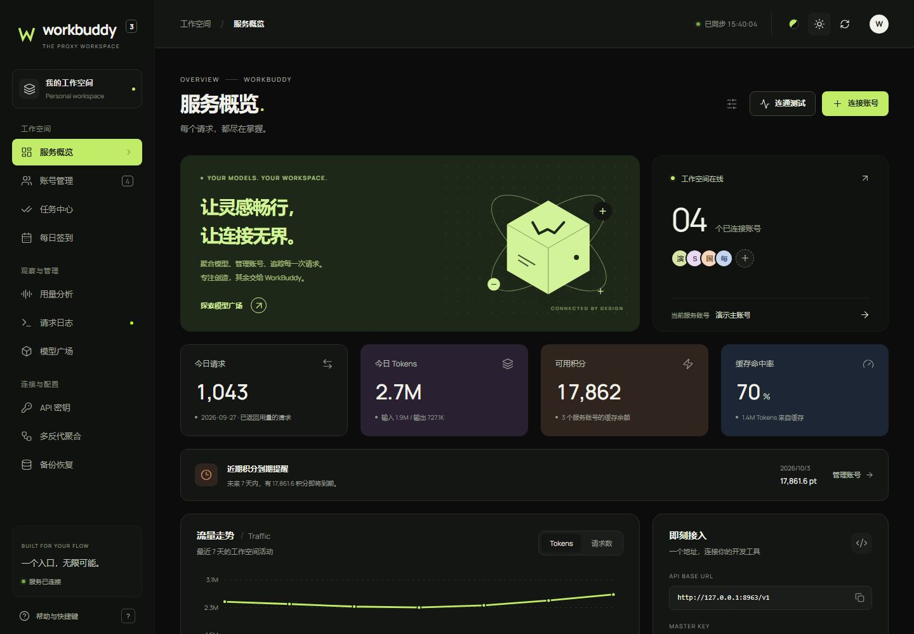
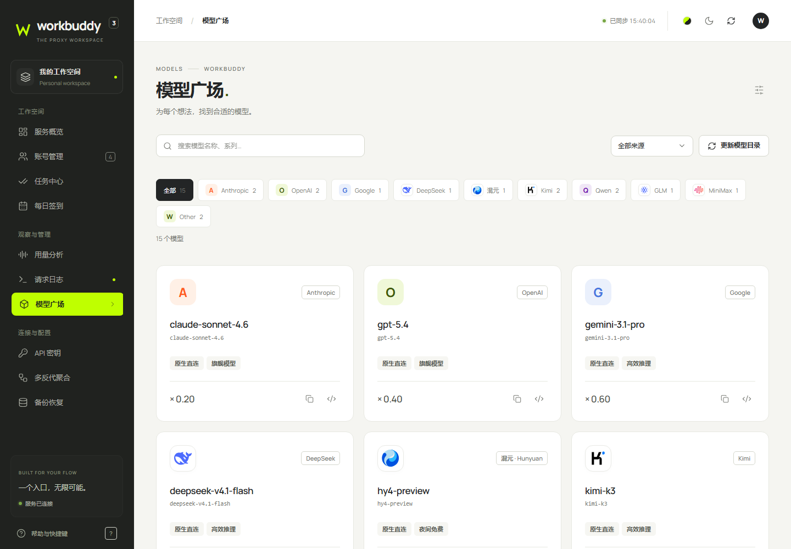
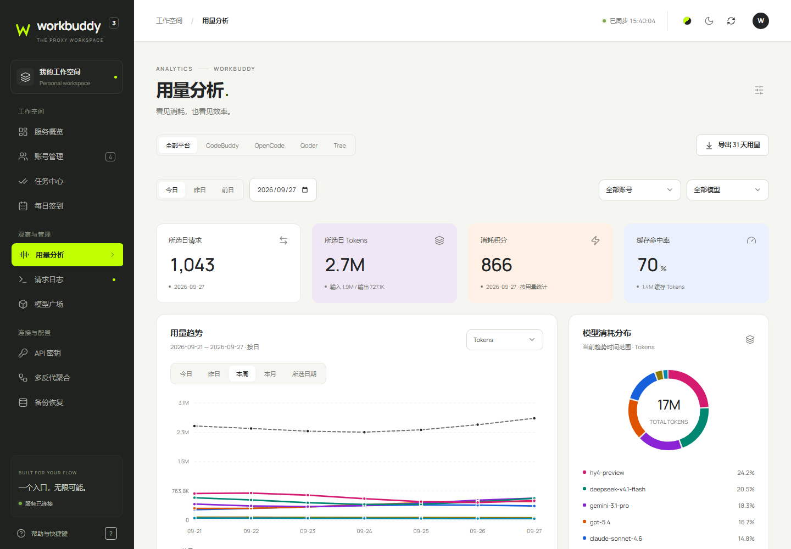
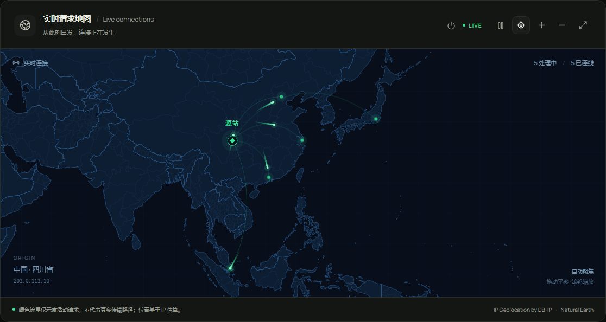

# WorkBuddy2API 图文介绍

[返回项目首页](../README.md) · [部署与维护](../README-deploy.md)

## 一个接口，一处管理

请求从兼容客户端进入 Node.js 服务，经过鉴权、配额和账号选择后交给上游；Vue 3 管理台负责配置与观察运行情况。



原生与各外部适配器的能力不完全相同。请通过模型广场和客户端实际验证需要的功能，不依据截图中的模型名称判断可用性。

## 服务概览

概览集中展示账号、用量、积分、流量趋势、最近请求和运行状态。首屏与数据分开加载，地图按需加载，关闭地图时不加载其前端组件。



## 配色与夜间模式

日间可在右上角切换八组配色：青柠与炭黑、熔岩与深海、帝王紫与柠檬、甜酷粉与黑曜石、霓虹蓝与电光紫、冰薄荷与樱桃红、晶石紫与电光荧、霓虹赤与电光蓝。夜间采用黑色底色。





## 模型与用量

模型广场展示当前服务能提供的模型，并提供筛选与接入信息。模型来源、倍率、活动标签等由上游与账号状态决定，不在文档中承诺固定价格或免费时段。



用量分析支持日期、模型及账号维度，区分输入、输出和缓存，并可查看请求数量和积分统计。不同模型使用高反差曲线，便于比较。



## 活动请求地图

地图仅展示处理中的请求，结束后移除轨迹。绿色流星循环表示“请求仍在进行”，并不表示真实网络传输进度。支持轨迹悬浮、详情固定、拖动、缩放、自动聚焦和全屏。



定位使用本地 DB-IP City Lite，底图使用 Natural Earth 矢量数据。中国省份及其他国家一级行政区仅在地理库有相应数据时展示；未知地址不伪造位置。内网、代理、NAT 都会影响定位解释。详情包含脱敏密钥信息，不显示完整 Key。

地图全局开关会同步关闭服务器追踪和定位 worker，适合不需要地图或希望减少资源占用的部署。[配置与数据来源](../backend/REQUEST-MAP.md)

## 管理流程

| 页面 | 常见操作 |
| --- | --- |
| 账号管理 | 连接自己的账号、切换服务账号、查看余额和有效期、配置轮换 |
| 任务中心 | 选择账号后扫描任务、执行日常或批量队列 |
| 每日签到 | 查看签到状态、手动执行签到 |
| 请求日志 | 查看成功 / 失败、耗时、模型和用量 |
| API 密钥 | 为不同客户端创建有权限边界的附加 Key |
| 多反代聚合 | 添加外部服务商、配置协议和模型映射、测试连通性 |
| 备份恢复 | 下载完整备份、校验导入、配置服务器自动备份 |

## 截图来源与复现

本页六张截图于 2026-09-28 由仓库构建产物和隔离 fixture 生成，使用合成账号与用量，源站地址替换为文档示例地址。截图中的模型、日期、地理坐标与价格均为演示，不是生产运行记录。

在仓库根目录运行：

```bash
npm --prefix frontend ci
npm --prefix frontend run build
# 若尚未安装 Playwright 的 Chromium：
cd frontend
npx playwright install chromium
cd ..
node frontend/scripts/capture-docs.mjs
```

脚本仅启动本机演示服务，不连接真实模型、不执行真实签到；将图片保存到 `docs/images/`。截图中的流星为某个动画帧，实际页面支持持续动画。
